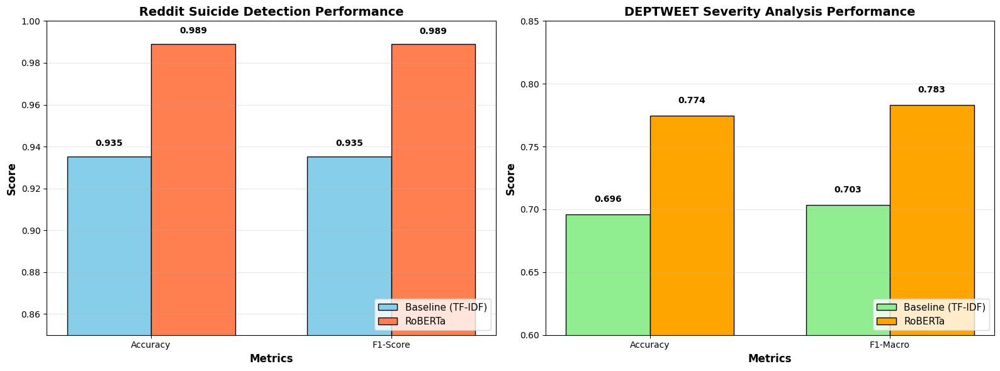
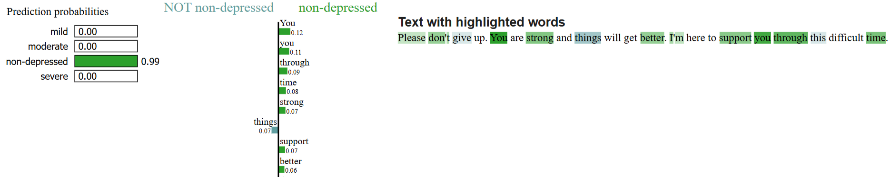

# 🧠 Explainable AI for Mental Health Text Classification

[](https://www.python.org/)
[](LICENSE)
[](https://colab.research.google.com/github/muh-emreozkan/anlp-mental-health-xai/blob/main/xai_anlp.ipynb)

> **Final Project for COMP561 - Advanced Natural Language Processing**  
> Işık University, Department of Computer Engineering  
> January 2026

**Research Question:** Can explainable AI techniques discover interpretable linguistic biomarkers that models learn to associate with mental health symptoms and severity levels?

---

## 📋 Table of Contents

- [Overview](#overview)
- [Key Results](#key-results)
- [Datasets](#datasets)
- [Models](#models)
- [Explainability Techniques](#explainability-techniques)
- [Installation](#installation)
- [Usage](#usage)
- [Project Structure](#project-structure)
- [Acknowledgments](#acknowledgments)
- [Citation](#citation)

---

## 🎯 Overview

This project investigates explainable AI for depression severity and suicide risk detection using transformer models. Through comprehensive XAI analysis (LIME, SHAP, Attention Visualization), we discover that RoBERTa performs **contextual semantic understanding** rather than keyword matching.

**Highlights:**
- 98.9% accuracy on suicide detection (Reddit)
- 77.4% accuracy on severity classification (DEPTWEET)
- +21% improvement through domain adaptation (C-SSRS)
- Convergent validation of linguistic biomarkers across 3 XAI techniques


*Figure 1: End-to-end pipeline from data preprocessing to explainable predictions*


*Figure 2: Model performance across three tasks*

---


## 🏆 Key Results

| Task | Dataset | Model | Accuracy | F1-Score | Improvement |
|------|---------|-------|----------|----------|-------------|
| Suicide Detection | Reddit | RoBERTa | **98.9%** | 98.9% | +5.4% |
| Severity Analysis | DEPTWEET | RoBERTa | **77.4%** | 78.3% | +8.0% |
| Clinical Validation | C-SSRS | Domain-Adapted | **80.0%** | 82.5% | +21.0% |

### Discovered Linguistic Biomarkers:
- **Severe:** suicide, kill, die, pain, end, lonely
- **Moderate:** depressed, anxiety, hurt, hopeless
- **Mild:** tired, exhausted, drained, frustrated
- **Supportive:** help, better, strong, support

---

## 📊 Datasets

We validated across three contexts:

1. **DEPTWEET** (5,474 tweets)
   - 4-class severity: mild, moderate, severe, non-depressed
   - Twitter mental health dataset (rehydrated)
   - BERT-based augmentation for class balance

2. **Reddit Suicide Detection** (232,074 posts)
   - Binary: suicide vs non-suicide
   - r/SuicideWatch and related communities
   - Perfectly balanced 50-50 split

3. **C-SSRS Clinical Validation** (500 posts)
   - Binary: risk vs non-risk
   - Psychologist-rated clinical posts
   - Tests domain adaptation necessity

📁 [Dataset sources and access information](datasets/data_sources.md)

---

## 🤖 Models

### Baseline: TF-IDF + Logistic Regression
- 3,000-5,000 n-gram features
- Interpretable keyword-based approach
- Reddit: 93.5% | DEPTWEET: 69.6%

### State-of-the-Art: RoBERTa-base
- 125M parameters, 12 layers, 12 attention heads
- Contextual understanding via transformers
- Fine-tuned separately for each task

**Training Setup:**
- Hardware: Google Colab T4 GPU
- Learning rate: 2-3e-5
- Batch size: 8-16
- Epochs: 3-5
- Time: ~10-15 min per model

---

## 🔍 Explainability Techniques

### 1. LIME (Local Interpretable Model-agnostic Explanations)
Word-level importance for individual predictions.



**Example:** *"I want to kill myself. I can't take this pain anymore."*
- "suicide" → +0.38 (strongest risk indicator)
- "pain" → +0.03
- "kill" → +0.12

### 2. SHAP (SHapley Additive exPlanations)
Global feature importance across all predictions.

**Top severe biomarkers:**
- end (0.189)
- depression (0.081)
- control (0.071)

### 3. Attention Visualization
Internal mechanisms: what RoBERTa focuses on layer-by-layer.

**Attention Entropy Analysis:**
- Severe: 2.210 (distributed processing)
- Supportive: 2.343 (most complex - requires full context)
- Mild: 1.923 (highly focused)

**Key Finding:** High entropy for supportive language proves contextual understanding, explaining RoBERTa's superiority over keyword-based TF-IDF.

---

## 💻 Installation

### 1. Clone Repository
```bash
git clone https://github.com/muh-emreozkan/anlp-mental-health-xai.git
cd anlp-mental-health-xai
```

### 2. Install Dependencies
```bash
pip install -r requirements.txt
```

### 3. Open in Google Colab
[](https://colab.research.google.com/github/muh-emreozkan/anlp-mental-health-xai/blob/main/xai_anlp.ipynb)

---

## 🚀 Usage

### Quick Start (Colab)
1. Open notebook in Colab (link above)
2. Runtime → Change runtime type → T4 GPU
3. Run all cells (Runtime → Run all)
4. Total execution time: ~2-3 hours

### Running Locally
```python
# Load notebook
jupyter notebook xai_anlp.ipynb

# Or run specific cells
from transformers import AutoTokenizer, AutoModelForSequenceClassification
# ... (see notebook for details)
```

### Key Cells:
- **Cell 1-2:** Setup & installations
- **Cell 3-6:** Data loading & EDA
- **Cell 7-10:** Model training & evaluation
- **Cell 11-15:** XAI analysis (LIME, SHAP, Attention)
- **Cell 16:** Final summary

---

## 📁 Project Structure
```
anlp-mental-health-xai/
│
├── xai_anlp.ipynb           # Main notebook (complete pipeline)
├── README.md                # This file
├── requirements.txt         # Python dependencies
├── LICENSE                  # MIT License
│
├── assets/                  # Screenshots & figures
│   ├── results_comparison.png
│   ├── lime_visualization.png
│   └── architecture.png
│
├── datasets/                # Dataset information
│   └── data_sources.md      # Links & access info
│
└── results/                 # (Generated after running)
    ├── models/              # Trained model checkpoints
    └── outputs/             # Performance metrics & plots
```

---

## 🎓 Key Findings

### 1. Context Over Keywords
RoBERTa's attention entropy (2.34 for supportive) proves distributed contextual processing, not keyword matching. This explains the 5-8% accuracy gains over TF-IDF.

### 2. Domain Adaptation Necessity
Social media models fail on clinical data (59%) without fine-tuning. Domain adaptation improved clinical validation by 21%, resolving the "Supportive Trap" phenomenon.

### 3. Convergent Biomarker Validation
LIME, SHAP, and Attention analysis all identified the same crisis vocabulary, confirming these are genuine learned patterns.

### 4. Multi-Class Challenge
Binary suicide detection (98.9%) far exceeds multi-class severity (77.4%), revealing that mild/moderate boundaries overlap clinically.

---

## ⚠️ Limitations

- **Language:** English-only (excludes 80% of global population)
- **Data:** Twitter rehydration yielded only 10.59% of original dataset
- **Validation:** No real-world clinical deployment testing
- **Context:** Text-only (no temporal patterns, demographics, or multi-modal data)

---

## 🔮 Future Work

1. **Multi-lingual extension** (Spanish, Mandarin, Arabic)
2. **Temporal progression modeling** (track users over time)
3. **Multi-modal integration** (text + posting behavior + emojis)
4. **Clinician-in-the-loop validation** (real-world deployment)
5. **Few-shot learning** for sample-efficient domain adaptation

---

## 🙏 Acknowledgments

This project was completed as part of COMP561 - Advanced Natural Language Processing at Işık University.

**Instructor:** Dr. Mehmet Can Yavuz  
**Institution:** Işık University
**Date:** January 2026

Special thanks to:
- Google Colab for providing free GPU resources
- HuggingFace for transformer model implementations
- The open-source NLP community for LIME, SHAP, and visualization tools

---

## 📧 Contact

**Muhammet Emre Özkan**  
📧 emre.ozkan@isikun.edu.tr

---

## 📄 License

This project is licensed under the MIT License - see the [LICENSE](LICENSE) file for details.

---

## ⭐ Star History

If you find this project helpful, please consider giving it a star! ⭐

---

**Note:** This is a research project for educational purposes. Models should assist mental health professionals, not replace them. Always seek professional help for mental health concerns.

**Crisis Resources:**
- 🇺🇸 National Suicide Prevention Lifeline: 988
- 🇹🇷 Turkish Crisis Hotline: 182
- 🌍 International: findahelpline.com
